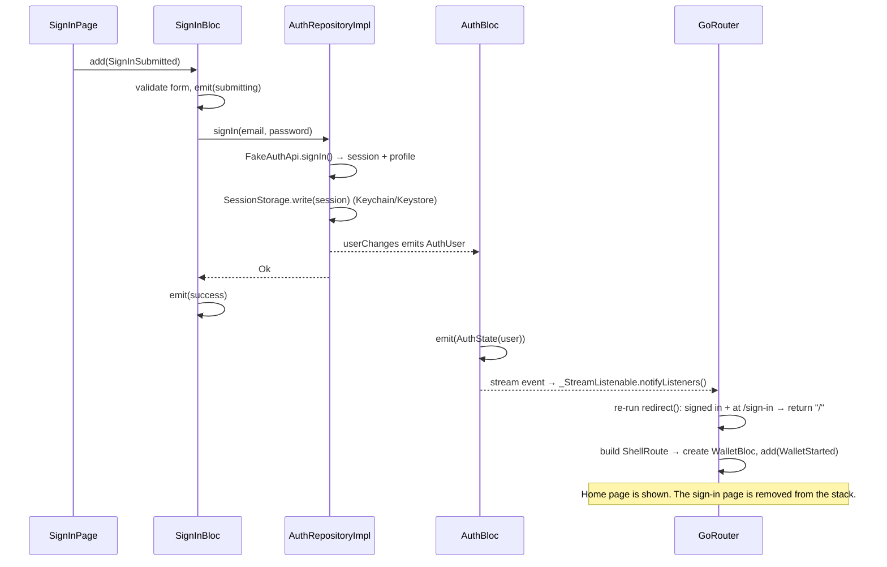

# features/auth/

Onboarding (splash, welcome, sign in, sign up with phone verification and profile), keeping the session across launches, the signed-in user's profile, and sign out.

| Folder | Purpose |
|---|---|
| `domain/` | `AuthRepository` interface, `AuthUser`, `AuthSession` and credential validators. |
| `data/` | Fake auth API, secure-storage session persistence and the repository implementation. |
| `presentation/` | `AuthBloc` (app-wide session), `SignInBloc` (form), `SignUpBloc` (the whole sign-up flow), the onboarding pages, avatar and sign-out dialog. |

> The fake backend accepts any valid email with a password of 8 or more characters. At sign-up it sends no SMS: any 4-digit code works except `0000`, which shows the wrong-code state.
>
> Sign-up follows the same navigation rule as sign-in: `SignUpBloc` moves between its own steps (`/sign-up` → `/phone` → `/verify` → `/profile`), and after the last one the repository announces the new user and the router redirects to the wallet. `SignUpBloc` lives in the auth `ShellRoute`, so it is disposed, along with the password and code, as soon as the user is signed in.

---

## How navigation to the home page works

**The sign-in screen never navigates.** It contains no `context.go('/')` or `Navigator.push`. Instead:

1. The page reports that sign-in succeeded.
2. That changes the app-wide auth state.
3. The router notices the change and moves the user to the right screen by itself.

The same mechanism handles app launch, deep links and sign-out, so there is one navigation rule instead of four.

### The pieces involved

| Piece | File | Role |
|---|---|---|
| `SignInBloc` | `presentation/bloc/sign_in/` | Validates the form and calls `AuthRepository.signIn`. Knows nothing about routes. |
| `AuthRepositoryImpl` | `data/auth_repository_impl.dart` | Saves the session, then emits the new `AuthUser` on the `userChanges` stream. |
| `AuthBloc` | `presentation/bloc/auth/` | App-wide. Listens to `userChanges` and holds `AuthState(user)`. `isAuthenticated` is `user != null`. |
| `_StreamListenable` | `lib/app/router.dart` | Turns `AuthBloc.stream` into a `Listenable` that go_router can watch. |
| `GoRouter.redirect` | `lib/app/router.dart` | **The only navigation rule:** who may see which route. |

### Step by step: tapping "Sign in"

1. **The form submits.** `SignInPage` sends `SignInSubmitted`. `SignInBloc` validates. If the form is valid it emits `submitting`, so the button shows a spinner, and calls `AuthRepository.signIn`.
2. **The session is saved first, then announced.** The repository waits for the fake API, writes the session to secure storage, and only then calls `_users.add(user)`. The order matters: if the app is killed right after, the next launch still finds the session.
3. **`AuthBloc` updates.** Its `AuthSubscriptionRequested` handler runs `emit.forEach(_authRepository.userChanges, ...)`, so every user the stream emits becomes a new `AuthState(user)`.
4. **The router is told to re-check.** `GoRouter` was created with `refreshListenable: _StreamListenable(authBloc.stream)`. Every `AuthBloc` state change calls `notifyListeners()`, and go_router re-runs `redirect` for the current location.
5. **`redirect` decides.** Signed in and still on `/sign-in`, so it returns the `from` query parameter if there is one, otherwise `/`.
6. **Home builds.** `/` sits inside a `ShellRoute` whose builder creates a fresh `WalletBloc` and sends `WalletStarted`. That bloc shows the cached wallet data straight away, then fetches fresh data.

Because this is a **redirect** and not a push, the sign-in page is **replaced**, not stacked. Pressing back on the home page exits the app instead of returning to sign-in.

### The other three paths use the same rule

| Situation | What happens |
|---|---|
| **App launch, already signed in** | `main.dart` awaits `authRepository.currentUser()` **before** `runApp`, so `AuthBloc` starts with the saved user. The first `redirect` for `/` sees `isAuthenticated == true` and returns `null` (stay). Home is the first frame, with no flash of the sign-in screen. |
| **App launch, signed out** | The first `redirect` for `/` sees no user and returns `/sign-in`. |
| **Deep link while signed out** (`tm30pay://tm30pay.app/transactions/txn_0042`) | `redirect` sends the user to `/sign-in?from=/transactions/txn_0042`. After sign-in, step 5 returns that `from` path, so the user lands on the transaction they opened, not on home. `from` is only followed if it starts with `/`, so a crafted link can't redirect to an external URL. |
| **Sign out** (Settings → Sign out) | `confirmSignOut` sends `AuthSignOutRequested`. The repository deletes the session and emits `null`. `AuthBloc` emits `AuthState(null)`, and `redirect` returns `/sign-in`. The `ShellRoute` leaves the tree, so its `WalletBloc` is **closed** (its stream subscriptions are cancelled). `main.dart` also clears the wallet cache, so the next user never sees the previous user's data. |

### Why not just call `context.go('/')` after sign-in?

- **One source of truth.** With navigation in two places (the page and the redirect), they can disagree. For example, the page navigates home while the session write failed.
- **Every screen follows it automatically.** A future "session expired" (a 401 during token refresh) only needs to emit `null` from the repository. The user is sent to sign-in from *whatever* screen they are on, with no extra navigation code.
- **Deep links keep working.** The `from` target is handled in the redirect, so it works however sign-in completes.
- **Testable without widgets.** `SignInBloc` tests check the state; they never need a router.

### Related concepts

- **`Stream` / broadcast `StreamController`.** `userChanges` is a broadcast stream, so more than one listener can subscribe. `AuthBloc` is one; the cache-clearing listener in `main.dart` is another. A single-subscription stream would throw on the second `listen`.
- **`emit.forEach`.** A Bloc helper that subscribes to a stream and emits a state for each value. The subscription is cancelled automatically when the bloc closes, so there is no `StreamSubscription` to clean up by hand. Its event uses `restartable()`, so only one subscription is ever live.
- **`refreshListenable`.** go_router doesn't know about blocs. It accepts any `Listenable` and re-runs `redirect` when it fires. `_StreamListenable` is the small adapter from a stream to a `Listenable`.
- **Redirect vs push.** A redirect replaces the current location, so the back stack does not keep sign-in. A push adds a page on top of the stack.
- **Loading before the first frame.** Awaiting the session in `main()` costs a few milliseconds while the native splash is still showing. In return, the router never has an "unknown" auth state and never shows the wrong screen first.
- **Scoping a bloc to a route.** `WalletBloc` lives in the `ShellRoute`, not above `MaterialApp`. The signed-in part of the navigation tree owns it, so it is created on sign-in and disposed on sign-out automatically.
