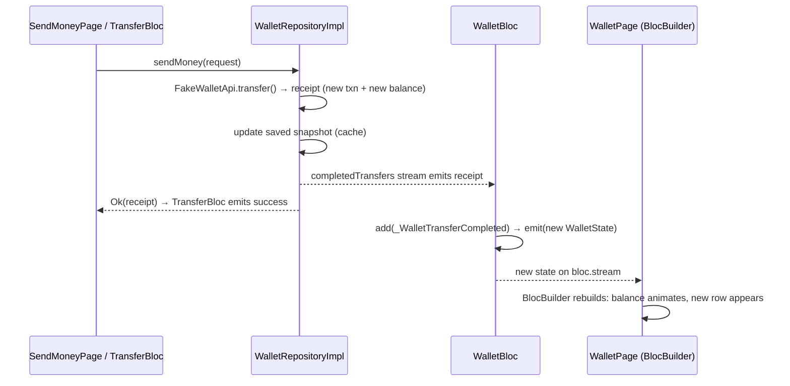

# wallet/presentation/pages/

| File | What it does |
|---|---|
| `wallet_page.dart` | The **home screen**: greeting header, balance card, Send/Receive actions, status banner, and transactions grouped by day in rounded cards. It also covers infinite scroll (a scroll listener sends `WalletNextPageRequested`), pull-to-refresh, skeleton loading, and the empty and error states. It takes an optional `clock` so tests have a predictable "Today". |
| `transaction_detail_page.dart` | `TransactionDetailPage`: large amount, status chip, and rows for description, type, date, account, note and reference. It handles loading, not found and error with retry. |

---

## How the balance and transaction list update live, without reloading the screen

After you send money, the home screen already shows the **new balance** and the **new transaction at the top** by the time you tap Done. There is no pull-to-refresh, no refetch and no rebuilt page. The Settings "Wallet data" section and the "Available" hint on the send form update the same way.

This works through a chain of four small mechanisms. None of them is special to this feature; they are the standard Bloc pattern.



### 1. The repository announces the change

`WalletRepositoryImpl.sendMoney` does three things when a transfer succeeds, in this order:

```dart
final result = await guard(() => _api.transfer(request));
if (result case Ok(value: final receipt)) {
  await _applyToCache(receipt);   // 1. device cache now includes the transfer
  _transfers.add(receipt);        // 2. tell every listener
}
return result;                    // 3. tell the caller (TransferBloc)
```

`_transfers` is a **broadcast `StreamController<TransferReceipt>`**, exposed as `completedTransfers`. The `TransferReceipt` carries the new `Transaction` and the new balance. Listeners get everything they need from it, so **nothing has to be refetched**.

### 2. `WalletBloc` listens and turns it into an event

The bloc subscribes once, in its constructor:

```dart
_transferSubscription = _repository.completedTransfers.listen(
  (receipt) => add(_WalletTransferCompleted(receipt)),
);
```

It does not change state inside the listener. It sends a **private event** (`_WalletTransferCompleted`), so a transfer is processed through the same event queue as everything else (refresh, next page) and can never interleave with them halfway through. `close()` cancels the subscription.

### 3. The handler emits a new, immutable state

```dart
void _onTransferCompleted(_WalletTransferCompleted event, Emitter<WalletState> emit) {
  final transaction = event.receipt.transaction;
  if (!state.hasData) return;                       // nothing on screen to patch yet
  final alreadyListed = state.transactions.any((t) => t.id == transaction.id);
  emit(state.copyWith(
    balance: event.receipt.newBalance,
    transactions: alreadyListed
        ? state.transactions
        : [transaction, ...state.transactions],     // new list, at the top
  ));
}
```

- It creates a **new list** and a **new state**, and never mutates the old one. `WalletState` is `Equatable`, so Bloc compares the new state with the old one and only notifies listeners if something actually changed.
- **Deduplication by id:** if a refresh already returned this transaction, it isn't added twice.
- **`nextCursor` is untouched.** The cursor points at the *last* loaded item, which hasn't moved, so infinite scroll keeps working after an item is inserted at the top. (With offset pagination, inserting a row would shift every later page by one.)

### 4. The widgets rebuild only what changed

`WalletPage` wraps its content in `BlocBuilder<WalletBloc, WalletState>`. When the new state arrives:

- **`BalanceCard`** receives the new `balance`. Its `AnimatedSwitcher` is keyed on the balance text, so the old amount fades out and the new one fades in.
- **The list** is regrouped by `groupByDay()`. The new transaction lands under "Today" at the top of the list. Each row has `ValueKey(transaction.id)`, so Flutter matches existing rows by id and **reuses** their elements. Only the new row is created; the rest are not rebuilt from scratch, and the scroll position is kept.
- Nothing is refetched, nothing is reloaded, and there's no spinner, because the state already contains the answer.

### Which screens update this way

`WalletBloc` is created once by the signed-in `ShellRoute` (see `lib/app/router.dart`), so **every signed-in screen reads the same instance**:

| Screen | How it reads the wallet | What updates |
|---|---|---|
| Home (`wallet_page.dart`) | `BlocBuilder<WalletBloc, WalletState>` | Balance card, transaction list, offline banner |
| Send money (`transfer/…/send_money_page.dart`) | `context.select((WalletBloc b) => b.state.balance)` | The "Available: ₦…" hint under the amount field |
| Settings (`settings/…/settings_page.dart`) | `context.watch<WalletBloc>()` | Available balance, transactions loaded, last updated, data source |
| Transaction detail (`transaction_detail_page.dart`) | Reads `WalletBloc` **once**, when opened | See below |

### The transaction detail page

The detail page shows **one transaction as it was when you opened it**. It has its own `TransactionDetailBloc`:

- If you tapped a row, the transaction is passed in (`extra`) or found with `WalletBloc.state.findTransaction(id)`. The bloc starts `ready`, so it appears instantly with **no request**.
- If you arrived by deep link, nothing is in memory yet, so the bloc fetches it by id (loading, then ready, or not found / error with Retry).

It does **not** subscribe to later changes. That is fine today, because transactions never change after they are created: the fake backend has no pending → success transitions. If they did, the fix would be to rebuild from `WalletBloc` with `context.select((WalletBloc b) => b.state.findTransaction(id))`, or to add a `transactionUpdates` stream in the repository following the same pattern as `completedTransfers`.

### Other live updates on the home screen

| Trigger | What updates | Mechanism |
|---|---|---|
| App launch | Cached data first, then fresh data | `WalletStarted` emits the cached snapshot, then the fetched one. The "Updating…" banner shows in between. |
| Pull to refresh / Retry | Balance and first page replaced | `WalletRefreshRequested`. `RefreshIndicator` awaits `bloc.stream.firstWhere((s) => s.status != loading)`, so the spinner stops exactly when the data arrives. |
| Scrolling near the bottom | Next 20 items appended | `WalletNextPageRequested` (`droppable()`). Footer spinner, then the new rows. |
| Network failure with data on screen | Offline banner appears; data stays | The state becomes `failure` but keeps its data. `isOffline` is derived from it. |
| Signing out | The whole wallet state is discarded | The `ShellRoute` is removed, `WalletBloc.close()` runs, and the cache is cleared. |

### Related concepts

- **Unidirectional data flow.** Widgets send events up; the bloc emits state down. A widget never changes the balance itself, so every update follows the same path.
- **Repository as the single source of truth.** `TransferBloc` and `WalletBloc` never reference each other. The repository is the meeting point, so either feature can change or be tested alone.
- **Broadcast vs single-subscription streams.** A broadcast stream allows many listeners and drops events when nobody is listening. That's correct here: if the wallet screen doesn't exist, there's nothing to patch, and the next load fetches fresh data anyway.
- **Immutability + `Equatable`.** New objects for every change make "did anything change?" a cheap equality check. That is how Bloc skips duplicate states and how `BlocBuilder` knows when to rebuild.
- **Granular rebuilds.** `BlocBuilder` rebuilds on any state change; `context.select` rebuilds only when the selected value changes. The send-money form uses `select` so typing in it is never disturbed by unrelated wallet updates.
- **Keys.** `ValueKey(id)` lets Flutter match old rows to new ones when the list changes shape, keeping row state and avoiding needless rebuilds.
- **Optimistic vs confirmed updates.** This app updates **after** the server confirms, because the receipt comes back from `sendMoney`. It is not optimistic: the balance never shows money leaving before the transfer is accepted, which is the right choice for a wallet.
- **Real-time from the server.** Today "real time" means *within the app*: changes the user makes show up everywhere at once. For money *received* from someone else, a real backend would push an event (WebSocket, Server-Sent Events or an FCM data message). The data layer would add it to the same kind of stream, and `WalletBloc` would handle it exactly like `_WalletTransferCompleted`. No widget would change.
